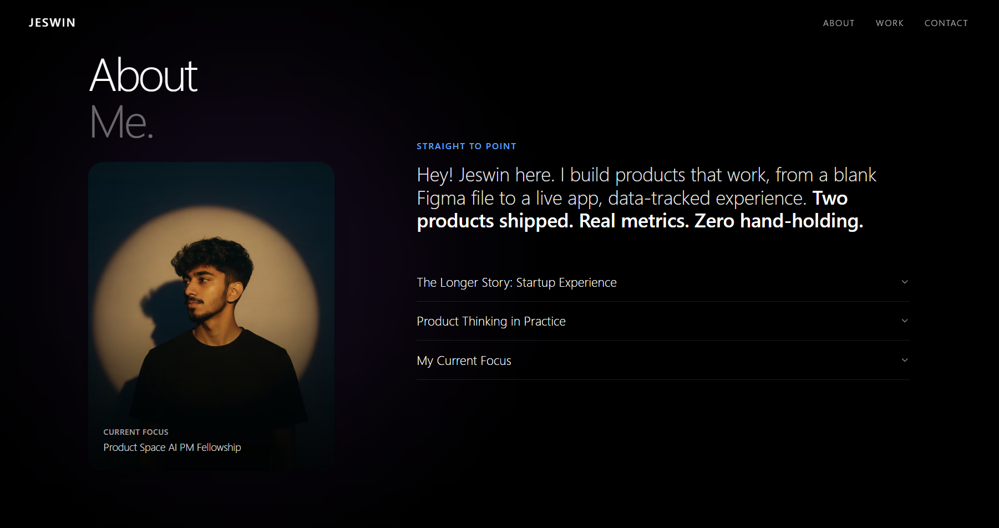

<div align="center">



# Jeswin Thomas Jestin — Portfolio

**Product Associate · PM Candidate · Builder**

[](https://jeswin-portfolio.vercel.app)
[](https://nextjs.org/)
[](https://www.typescriptlang.org/)
[](https://www.framer.com/motion/)

</div>

---

A high-end, 3D scrollytelling portfolio built to showcase product thinking, real startup metrics, and technical execution. Not a template — designed and shipped from scratch.

## ✨ Features

- **🎞️ 3D Canvas Scrollytelling** — 120-frame webp sequence rendered on a sticky `500vh` canvas, creating a video-scrubbing illusion with zero `<video>` overhead
- **⚡ Framer Motion Parallax** — Cinematic text entrance/exit animations perfectly synced to `scrollYProgress`
- **🪞 Glassmorphism UI** — Advanced glass cards with `backdrop-blur`, ambient hover glow, and thin `border-white/10` treatment
- **📱 Fully Responsive** — Crisp on retina displays via dynamic `devicePixelRatio` upscaling
- **🔍 Full SEO Suite** — OpenGraph, Twitter Cards, JSON-LD `Person` + `ProfilePage` schema, sitemap, and AI-crawler allowlists (GPTBot, ClaudeBot, PerplexityBot)
- **🔒 Security Hardened** — CSP, HSTS, X-Frame-Options, Permissions-Policy, and zero `X-Powered-By` header via `next.config.mjs`
- **♿ Accessible** — Semantic HTML5, proper `alt` attributes, Next.js `<Image>` for all assets

## 🚀 Tech Stack

| Layer | Technology |
|---|---|
| Framework | [Next.js 14](https://nextjs.org/) (App Router) |
| Language | [TypeScript 5](https://www.typescriptlang.org/) |
| Animation | [Framer Motion 12](https://www.framer.com/motion/) |
| Styling | [Tailwind CSS v3](https://tailwindcss.com/) |
| Scroll | [Lenis](https://lenis.darkroom.engineering/) via `@studio-freight/react-lenis` |
| UI Components | [Radix UI](https://www.radix-ui.com/) (Accordion) |
| Graphics | Vanilla HTML5 Canvas API |
| Icons | [Lucide React](https://lucide.dev/) |
| Deployment | [Vercel](https://vercel.com/) |

## 🛠️ Local Setup

```bash
# Clone the repository
git clone https://github.com/JeswinJestin/Jeswin_3D-Scroll-Portfolio.git
cd Jeswin_3D-Scroll-Portfolio

# Install dependencies
npm install

# Start the development server
npm run dev
```

Open [http://localhost:3000](http://localhost:3000) and scroll slowly to experience the sequence.

## 📂 Key Files

```
src/
├── app/
│   ├── layout.tsx          # Global metadata, OpenGraph, SEO
│   ├── page.tsx            # JSON-LD structured data + page assembly
│   ├── sitemap.ts          # Auto-generated sitemap.xml
│   ├── robots.ts           # Crawler directives (incl. AI bots)
│   ├── icon.png            # App favicon
│   └── apple-icon.png      # iOS home screen icon
├── components/
│   ├── ScrollyCanvas.tsx   # Core 120-frame canvas scroll engine
│   ├── Overlay.tsx         # Parallax text mapped to scroll depth
│   ├── AboutSection.tsx    # Accordion-based professional story
│   ├── ExperienceTimeline.tsx
│   ├── Projects.tsx        # 3D tilt cards with project thumbnails
│   ├── EducationSkills.tsx
│   ├── Navbar.tsx
│   └── Footer.tsx          # Contact form + social links
public/
├── images/                 # Project thumbnails, social preview, about photo
└── sequence/               # 120 optimized webp frames for canvas
next.config.mjs             # Security headers + image optimization
vercel.json                 # Vercel deployment config
```

## 🔍 SEO & AI Search Optimization

This portfolio is optimized for both traditional search engines and LLM-based AI search platforms:

- **Schema.org** `Person` + `ProfilePage` JSON-LD for Google rich results
- **OpenGraph & Twitter Cards** for rich link previews on LinkedIn and social
- AI crawlers explicitly allowed: `GPTBot`, `PerplexityBot`, `ClaudeBot`, `Google-Extended`
- Canonical URL, meta keywords, and structured authorship signals

## 🤝 About the Builder

Built by **Jeswin Thomas Jestin** — PM Intern Candidate with hands-on experience shipping full-stack products at EdTech and FinTech startups. Two products shipped. Real metrics. Zero hand-holding.

📩 [jeswinjestin203@gmail.com](mailto:jeswinjestin203@gmail.com) · [LinkedIn](https://www.linkedin.com/in/jeswinjestin) · [Behance](https://www.behance.net/jeswinjestin) · [GitHub](https://github.com/jeswinjestin)

---

<div align="center">
<sub>Coded with precision to bridge design and engineering.</sub>
</div>
